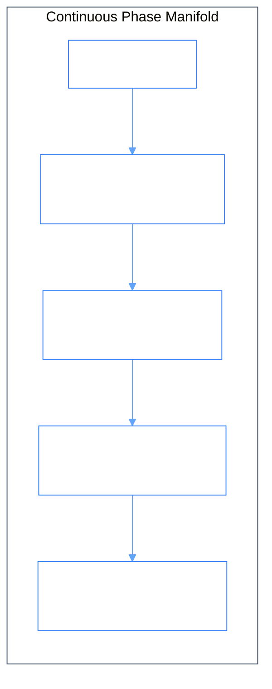

# Phiano

> _From **piano** (Italian: soft/loud) - A continuous phase manifold and cognitive oscillator engine for language._

[](Cargo.toml)
[](docs/MASTER_CONNECTIONS.md)
[](docs/README.md)
[](LICENSE)

---

## 1. How It Works

Phiano maps words onto a continuous phase manifold where semantic similarity is measured by destructive wave interference. Words are keys, phasors are notes, sentences are chords, and training is tuning - the model self-organizes like an acoustic instrument that tunes itself.



### The Complex Phasor Equation

Each vocabulary token is represented as a complex coordinate on a continuous $2\pi$ circle:

$$\mathbf{Z} = A \cdot e^{i(\phi + n\alpha)}$$

Where:
- **$A$** is the amplitude (familiarity and usage weight).
- **$\phi$** is the primary phase angle $\in [0, 2\pi)$.
- **$n$** is the quantized energy sub-band level $\in \{0, 1, 2, \dots, 15\}$.
- **$\alpha$** is the Sommerfeld fine-structure constant ($\approx 1/137.036$).

### Destructive Interference Distance Metric

Semantic distance between two concepts is calculated through destructive wave interference:

$$\Delta(\mathbf{Z}_1, \mathbf{Z}_2) = \alpha \cdot \|\mathbf{Z}_1 - \mathbf{Z}_2\|^2$$

Lower energy delta indicates stronger semantic alignment and constructive resonance.

---

## 2. Recursive 5-Stage Learning Cycle

Every interaction triggers the self-tuning feedback loop:

$$\text{envision} \longrightarrow \text{apply} \longrightarrow \text{eval} \longrightarrow \text{iterate} \longrightarrow \text{scale}$$

1. **Envision** ([`src/envision.rs`](src/envision.rs)) - Detects unknown words and constructs initial semantic hypotheses.
2. **Apply** ([`src/trainer/mod.rs`](src/trainer/mod.rs)) - Updates phasor angles using Kuramoto non-linear phase attraction:
   $$\phi_i \leftarrow \phi_i + K \sin(\psi_{\text{centroid}} - \phi_i)$$
3. **Eval** ([`src/eval.rs`](src/eval.rs)) - Measures coherence order parameter $r \in [0, 1]$, novelty delta $\Delta$, and harmonic resonance.
4. **Iterate** ([`src/memory/mod.rs`](src/memory/mod.rs)) - Logs insights across the 16-layer memory hierarchy.
5. **Scale** ([`src/storage.rs`](src/storage.rs)) - Persists the tuned manifold state to disk using high-speed binary serialization.

---

## 3. Generative Engine & Narrative Composition

Phiano provides two generative mechanisms:

1. **Phase-Guided Sequence Generator** ([`src/generate.rs`](src/generate.rs)):
   Maintains a `ContextWaveBuffer` running superposition and uses harmonic attention ([`src/attention.rs`](src/attention.rs)) with ray-casting to emit coherent next-token sequences.

2. **Recursive Narrative Composer (`RiverFlow`)** ([`src/compose/flow/mod.rs`](src/compose/flow/mod.rs)):
   Wove narratives along chromatic phase sectors across three harmonic movements:
   - **Opening** (Source Oscillator Frequency)
   - **Tension** (Orthogonal Wave Offset & Contrast)
   - **Resolution** (Kuramoto Synchronization & Harmonic Equilibrium)

---

## 4. 16-Layer Cognitive Memory Hierarchy

Interactions are classified into 16 discrete memory layers across 4 octave bands:

| Band | Layers | Cognitive Level & Description |
|:---|:---|:---|
| **Deep Band** | 12–15 | Universal archetypes, cross-domain morphisms, and high-level discourse strategy |
| **Semantic Band** | 8–11 | Formal dictionary definitions, thematic roles, synonym clustering, and etymology |
| **Pattern Band** | 4–7 | Bigram/trigram transition probabilities, idiomatic expressions, and cadence |
| **Surface Band** | 0–3 | Raw orthographic token phasors, phonetic frequencies, and byte streams |

---

## 5. Persona Fingerprinting & Impersonation

Phiano extracts an author's unique voice into a 16-sector chromatic fingerprint:

```bash
# Extract persona from raw text
phiano> persona from hemingway "The old man fished alone in the skiff. He had gone eighty-four days without taking a fish."

# Interactive chat in Hemingway's style
phiano> persona chat hemingway
```

---

## 6. Project Architecture

```
phiano/
├── src/                  # Core Rust Engine (28 specialized modules)
│   ├── lib.rs            # Library entrypoint
│   ├── main.rs           # Binary entrypoint (CLI / REPL / Server)
│   ├── generate.rs       # Phase-guided sequence generator
│   ├── compose/          # RiverFlow narrative composer
│   ├── reasoning.rs      # Phase-space deductive pathfinding
│   ├── oscillator/       # 3D spinning sphere oscillator field
│   ├── persona/          # Persona fingerprinting & voice synthesis
│   ├── trainer/          # Kuramoto phase attraction trainer
│   ├── facet.rs          # Facet lexicon & phasor store
│   ├── wave.rs           # Wave superposition & ray-casting
│   └── server/           # Axum REST API endpoints
├── web/                  # React + Vite Interactive Visualization Dashboard
├── tests/                # Comprehensive Python & integration test suite (16 tests)
├── scripts/              # Command-line utilities, downloaders & demos (7 scripts)
├── data/                 # Webster's dictionary & Rust Book training corpora
├── docs/                 # 44 Technical architecture whitepapers & specifications
├── tasks/                # Recipe scripts & demo scenarios
└── specs/                # Formal mathematical specifications
```

---

## 7. Quick Start

Full walkthrough: **[Getting Started (5 min)](docs/62_getting_started.md)** · tunables: **[Configuration](docs/63_configuration.md)**

```bash
cargo build --release
cargo run --release --bin bootstrap_facet   # trains + saves data/manifold.chroma
cargo run --release --bin bench             # coherence / novelty / resonance
cargo run --release -- --web                # API + PUI on :3000
```

### Running the Rust CLI & REPL

```bash
# Start interactive REPL
cargo run

# Run full showcase demo
cargo run < tasks/showcase.txt
```

### REPL Commands

```
phiano> learn "the cat sat on the mat"
phiano> learn "the dog sat on the rug"
phiano> synonym cat 5
phiano> eval "the cat sat on the mat"
phiano> reason "why does the cat sit on the mat"
phiano> stats
phiano> exit
```

### Running the Web Dashboard & API Server

```bash
# 1. Start the API server
cargo run -- --server

# 2. Launch the Web Dashboard
cd web
npm install
npm run dev
```

Open `http://localhost:5173` to inspect the live 3D oscillator sphere, phase circle, and Kuramoto order parameter.

---

## 8. Master Documentation

- **[Master Connections Map](docs/MASTER_CONNECTIONS.md)** - Complete mathematical dataflows and module connection matrix.
- **[Architecture Overview](docs/02_architecture_overview.md)** - System topology and recursive learning cycle.
- **[Complete File Map](docs/32_file_map.md)** - Detailed file index across all subdirectories.
- **[Documentation Index](docs/README.md)** - Catalog of all 44 technical whitepapers.

---

## License

MIT © [GemPhi](https://github.com/gemphi)
