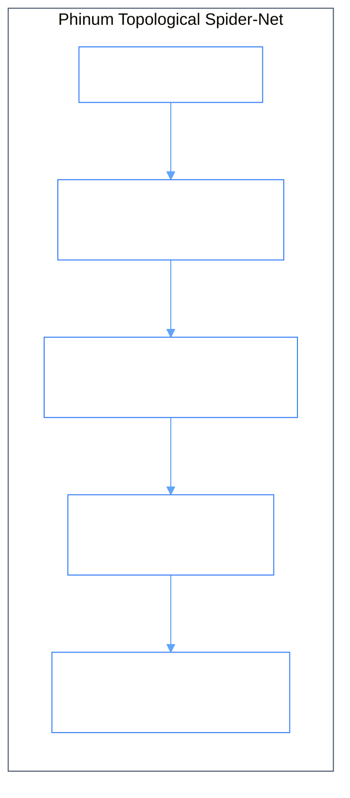

# Phiano & Phinum

> _From **piano** (Italian: soft/loud) & **phinum** (numerical phase harmonic) — A continuous phase manifold, cognitive oscillator engine, and 32-core topological language instrument._

[](Cargo.toml)
[](PLAN.md)
[](src/phinum/mod.rs)
[](src/phinum/iching/mod.rs)
[](LICENSE)

---

## 1. How It Works

Phiano maps words and language structures onto a continuous phase manifold $\mathbb{C}^N$ where semantic similarity and syntactic relationships are measured by geometric phase resonance. Words are keys, phasors are notes, sentences are chords, and training is self-tuning Kuramoto oscillator synchronization.



### The Complex Phasor Equation

Each vocabulary token is represented as a complex coordinate on a continuous $2\pi$ circle:

$$\mathbf{Z} = A \cdot e^{i(\phi + n\alpha)}$$

Where:
- **$A$** is amplitude (familiarity and usage weight).
- **$\phi$** is primary phase angle $\in [0, 2\pi)$.
- **$n$** is the quantized energy sub-band level $\in \{0, 1, 2, \dots, 15\}$.
- **$\alpha$** is the Sommerfeld fine-structure constant ($\approx 1/137.036$).

---

> **Measured results.** Figures in this README are design targets. For what the
> system actually scores on held-out data — perplexity against a Kneser-Ney
> baseline, relation accuracy, catastrophic-forgetting retention, and real model
> sizes — see [`docs/how/RESULTS.md`](docs/how/RESULTS.md). Where a measurement
> contradicts a target, the measurement is correct. Notably: a dictionary-scale
> model is **59.2 MB**, not the 2-12 MB targeted below; the phase manifold does
> not currently improve next-word prediction over word frequency; and forgetting
> retention is 93-98%, not zero.

---

## 2. Phinum Multi-Resolution Engines (16 | 32 | 64 Cores)

| Engine | Active Resolution | Angular Width | Harmonic Perspectives | Target Deployment |
| :--- | :--- | :--- | :--- | :--- |
| **Phinum16** | 16 Cores | $\Delta\theta = 22.5^\circ$ ($2\pi/16$) | 16 Perspectives | Ultra-lightweight edge & microcontroller inference (~2 MB) |
| **Phinum32** | 32 Cores | $\Delta\theta = 11.25^\circ$ ($2\pi/32$) | 32 Perspectives | Balanced conversational dialogue & semantic routing (~5 MB) |
| **Phinum64** | 64 Cores | $\Delta\theta = 5.625^\circ$ ($2\pi/64$) | 64 Perspectives ("64 ways to look at anything") | High-fidelity cognitive reasoning & I Ching spider-net (~12 MB) |

---

## 3. The 32 Core Modules (Unified System Architecture)

```
Phinum 32-Core Topological Architecture
├── Tier 1: Lexical & Physical Foundations (Modules 1–8)
│   ├── 01. lexicon        ── Lexicon Manifold & Complex Phasor Table
│   ├── 02. phasor         ── Complex Spectral Phasor Arithmetic (C^N)
│   ├── 03. wave           ── Superposition Wave Mechanics & Context Buffer
│   ├── 04. phiton         ── Light Quanta & Electromagnetic Visible Spectrum
│   ├── 05. gemgum         ── Chromatic Sector Field & Unitary Energy Invariants
│   ├── 06. phical         ── Color-Space-Time Topology & Geometric Manifolds
│   ├── 07. oscillator     ── Coupled Kuramoto Oscillators & Bloch Sphere
│   └── 08. tokenizer      ── Multilingual Tokenizer & Boundary Segmenter
│
├── Tier 2: Syntactic & Structural Spider-Net (Modules 9–16)
│   ├── 09. pos_tagger     ── Part-of-Speech & Grammatical Class Analyzer
│   ├── 10. syntax_net     ── Sentence Structural Key Extractor & Chain Matcher
│   ├── 11. clause_graph   ── Clause Hierarchy & Dependency Tree Lattice
│   ├── 12. sentence_type  ── Sentence Mood & Modal Typology Classifier
│   ├── 13. paragraph_type ── Discourse & Paragraph Form Classifier
│   ├── 14. structural_keys── Zero-Storage Invariant Hasher & Key Indexer
│   ├── 15. iching         ── I Ching 64-Hexagram & Trigram Spin Engine
│   └── 16. spider_net     ── Global Topological Language Spider-Net Graph
│
├── Tier 3: Searle Intentionality & Cognitive Processing (Modules 17–24)
│   ├── 17. searle_acts    ── Searle Speech Act Taxonomy
│   ├── 18. direction_of_fit── Direction-of-Fit Engine (Words-to-World / World-to-Words)
│   ├── 19. intentionality ── BDI (Belief / Desire / Intention) State Vectors
│   ├── 20. satisfaction   ── Conditions of Satisfaction Evaluator
│   ├── 21. attention      ── Multi-Head Phase Sector Self-Attention
│   ├── 22. attention_cross── Spectral Phase Cross-Attention Projector
│   ├── 23. reasoning_hybrid── Value-Centric Geometric + Program-Centric Analogy
│   └── 24. cognitive_core ── 16-Agent Dual-Cognitive Synthesis Pipeline
│
└── Tier 4: Phinum Resolution Engines & Lifelong Learning (Modules 25–32)
    ├── 25. phinum16       ── Phinum-16 Core Engine (16-Sector Coarse Resolution)
    ├── 26. phinum32       ── Phinum-32 Core Engine (32-Sector Intermediate Resolution)
    ├── 27. phinum64       ── Phinum-64 Core Engine (64-Sector High-Fidelity 64-Perspective)
    ├── 28. composer       ── Recursive Flower-Hayes Planning/Translating/Reviewing
    ├── 29. instruction    ── Instruction Parsing, Template Engine & Execution
    ├── 30. synthesis      ── Discrete Program AST Synthesis & Beam Search
    ├── 31. lifelong       ── LifelongLearner & Persistent ComponentLibrary
    └── 32. server         ── Axum REST API, SSE Telemetry & Web Gateway
```

---

## 4. Quick Start

```bash
# Build release binaries
cargo build --release

# Run full test suite (68 tests)
cargo test

# Bootstrap facet manifold
cargo run --release --bin bootstrap_facet

# Start the interactive REPL
cargo run

# Launch the Web Dashboard & API server on :3000 / :5173
cargo run -- --web
```

---

## License

MIT © [GemPhi](https://github.com/gemphi)
