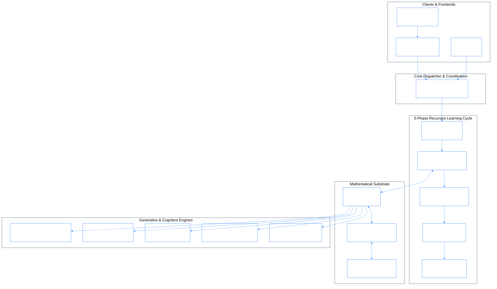

# 02 - Phiano Architecture Overview

> _High-level system topology, recursive learning cycle, and module interaction pipeline._

---

## 1. Complete Architecture Topology

---

## 2. The 28 Core Modules

Phiano's core engine is structured into 28 specialized, zero-overhead Rust modules in [`src/`](file:///c:/Users/phiac/Workspace/gemphi/phiano/src/):

| Category | Modules | Purpose |
|:---|:---|:---|
| **Phase Mathematics** | `phasor.rs`, `wave.rs`, `config/` | Complex numbers, $2\pi$ circle coordinates, fine-structure quantization |
| **Lexicon & Training** | `facet.rs`, `trainer/`, `tokenizer.rs`, `chunker.rs`, `curriculum.rs` | Kuramoto coupling, vocabulary self-tuning, parallel chunking |
| **Cognitive Memory** | `memory/`, `layers.rs`, `storage.rs`, `envision.rs`, `eval.rs` | 16-layer memory, gap detection, coherence evaluation, bincode persistence |
| **Generative Systems** | `generate.rs`, `compose/`, `attention.rs`, `synthetic.rs` | Context wave superposition, RiverFlow narrative generation, attention |
| **Reasoning & Oscillators**| `reasoning.rs`, `oscillator/`, `cognitive/`, `persona/` | Phase pathfinding, 3D sphere projection, persona fingerprinting |
| **Servers & Sources** | `server/`, `sources/`, `command/`, `drivers/`, `wiki_bulk.rs` | Axum HTTP server, Webster's dictionary ingester, CLI REPL commands |

---

## 3. Related Documentation

- For the full cross-module connection matrix, see [`MASTER_CONNECTIONS.md`](./MASTER_CONNECTIONS.md).
- For complete file map, see [`32_file_map.md`](./32_file_map.md).
- For theoretical foundation, see [`03_phase_manifold.md`](./03_phase_manifold.md).
