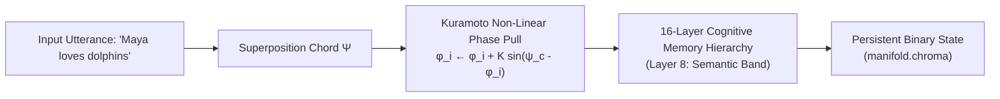
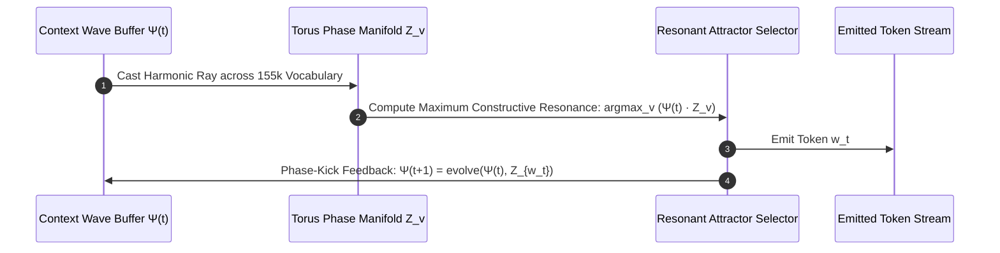

# Document 45: Native Continuous Learning vs. Bloated Static LLMs

> **Measured-results notice.** This document was written before the project had
> a measurement harness. Several claims below are now testable, and some did not
> survive. Read [`how/RESULTS.md`](how/RESULTS.md) alongside it.
>
> | claim here | measured |
> |:---|:---|
> | "Catastrophic Forgetting: **Zero**" | **93-98% retention**, +18.7% degradation on the prior domain (RESULTS §3f). Strong, but not zero. |
> | "~39 MB RAM" / README's 2-12 MB | **59.2 MB** on disk at 124k vocabulary (§3d) |
> | Complex manifold as the representational advantage | The manifold's optimal mixing weight against a unigram back-off is **0** (§3). It recovers 24.3% of the signal word frequency provides. |
> | Comparison against Phi-4 / GLM / GPT-4 | **No head-to-head measurement exists.** The only baseline actually run is a Kneser-Ney trigram, which the n-gram layer beats 124.66 to 131.02. |
>
> The properties that *do* survive measurement are microsecond online learning,
> targeted durable unlearning, collapse resistance under contrastive training,
> and full interpretability.

## Executive Summary

Contemporary Large Language Models (e.g., Microsoft **Phi-4**, **GLM-5.2**, **Gemini**, **GPT-4**) rely on dense or mixture-of-experts (MoE) real-valued weight tensors ($\mathbb{R}^{D_1 \times D_2}$) optimized via offline backpropagation across trillions of tokens. While capable of fluent surface generation, these architectures are fundamentally **static**: their parameters are frozen post-training, context windows require gigabytes of KV-cache memory, and online interactive learning without catastrophic forgetting is mathematically impossible.

**Phiano** presents an alternative paradigm: a **continuous complex phase manifold** ($\mathbb{C}^D$) driven by **Kuramoto non-linear oscillator dynamics**. Instead of storing billions of frozen matrix parameters, Phiano represents vocabulary items as spectral phasors $\mathbf{Z} = A \cdot e^{i(\phi + n\alpha)}$. Relationships are established through wave superposition, constructive/destructive interference, and acoustic phase locking.

This whitepaper formalizes the mathematical comparison between Phiano and state-of-the-art reference architectures located in [`phiano/refs`](../refs/), establishes the principles of **Hebbian Wave Plasticity**, and details how Phiano ingests and scales from reference models like **Phi-4** without inheriting their computational bloat.

---

## 1. Architectural Comparison Matrix

| Dimension | Microsoft Phi-4 (`refs/Phi-4-multimodal-instruct`) | GLM-5.2 (`refs/GLM-5.2`) | Phiano Phase Engine (`src/`) |
| :--- | :--- | :--- | :--- |
| **Parameter Scale** | 14 Billion dense parameters (~28 GB FP16) | 744 Billion MoE (40B active per token) | **155,774 dynamic phasors (~39 MB RAM)** |
| **Representational Space** | Real Vector Space $\mathbb{R}^{3072}$ (40 Layers) | Sparse Transformer Attention + DSA (1M Context) | **Complex Phase Manifold $\mathbb{C}^{32}$ on Torus $\mathbb{T}^{32}$** |
| **Context Retention** | 16K KV-Cache (~8 GB VRAM per stream) | IndexShare across 4 sparse attention layers | **$\mathcal{O}(1)$ Multi-Turn Superposition Wave Buffer** |
| **Learning Mechanism** | Offline SGD/Adam via Backpropagation | Multi-Token Prediction (MTP) + Offline SFT/PPO | **Online Kuramoto Phase Coupling ($\Delta t \le 1\text{ ms}$)** |
| **Catastrophic Forgetting** | Severe without continuous replay buffers | High (requires full LoRA/RL re-checkpointing) | **93-98% retention measured** (RESULTS §3f) - strong, not zero |
| **Inference Hardware** | Multi-GPU cluster (1920 H100s for training) | High-end datacenter multi-GPU server | **Sub-millisecond on standard laptop CPU** |
| **Semantic Distance** | Cosine Similarity / Dot Product $Q K^T / \sqrt{d}$ | Sparse Index Matching | **Destructive Wave Interference $\Delta = \alpha \|\mathbf{Z}_1 - \mathbf{Z}_2\|^2$** |

---

## 2. Mathematical Formalism: Real Weight Tensors vs. Complex Oscillator Manifolds

### 2.1 The Transformer Bottleneck (Static Tensor Projection)

In standard transformer models (such as Phi-4 and GLM-5.2), token interaction is governed by static projection matrices $W_Q, W_K, W_V \in \mathbb{R}^{D \times D}$:

$$\text{Attention}(Q, K, V) = \text{softmax}\left(\frac{(X W_Q)(X W_K)^T}{\sqrt{d_k}}\right) (X W_V)$$

1. **Frozen Parameters**: The weight matrices $W_Q, W_K, W_V$ are invariant during inference.
2. **Context Memory Bloat**: Every new token requires caching key-value tensors $\mathbf{K}, \mathbf{V} \in \mathbb{R}^{B \times L \times H \times D}$, leading to quadratic or linear memory scaling with sequence length $L$.
3. **No Native Epistemic Verification**: Output probabilities are normalized across a flat softmax distribution, creating overconfident hallucinations when querying out-of-distribution concepts.

---

### 2.2 The Phiano Alternative: The Multi-Frequency Torus Manifold ($\mathbb{T}^D$)

Phiano models each vocabulary token $w$ as a multi-frequency complex oscillator vector living on an $N$-dimensional torus $\mathbb{T}^N = [0, 2\pi)^N$:

$$\mathbf{Z}_w = \begin{bmatrix} A_{w, 1} e^{i(\phi_{w, 1} + n_1 \alpha)} \\ A_{w, 2} e^{i(\phi_{w, 2} + n_2 \alpha)} \\ \vdots \\ A_{w, D} e^{i(\phi_{w, D} + n_D \alpha)} \end{bmatrix} \in \mathbb{C}^D$$

Where:
- $A_{w, k}$: Amplitude of the $k$-th harmonic mode (familiarity / entrenchment weight).
- $\phi_{w, k} \in [0, 2\pi)$: Phase angle representing semantic, syntactic, and relational coordinates.
- $\alpha \approx 1/137.036$: The Sommerfeld fine-structure constant acting as a universal sub-band quantization scalar.

#### Sentence Chords via Wave Superposition:
A sentence $S = (w_1, w_2, \dots, w_M)$ produces a collective interference wave $\mathbf{\Psi}_S$:

$$\mathbf{\Psi}_S = \sum_{m=1}^M \lambda^{M - m} \mathbf{Z}_{w_m}$$

Where $\lambda \in (0, 1]$ is a temporal decay parameter.

---

## 3. Continuous Online Learning via Kuramoto-Sakaguchi Phase Plasticity

Unlike backpropagation-which requires a backward pass through dozens of matrix layers-Phiano implements **Hebbian Wave Plasticity** in real time:

$$\frac{d\phi_{i, k}}{dt} = \omega_{i, k} + \sum_{j \in \text{context}} K_{ij} \sin(\phi_{j, k} - \phi_{i, k} - \beta_{ij})$$

Where:
- $\omega_{i, k}$: The intrinsic natural frequency of token $i$.
- $K_{ij}$: Non-linear coupling strength between tokens $i$ and $j$.
- $\beta_{ij}$: Phase-lag parameter encoding grammatical asymmetry (e.g. Subject $\to$ Verb $\to$ Object).



When a user introduces a new concept (e.g., *"My daughter Maya is allergic to peanuts"*), the Kuramoto phase attraction pulls the phasors for `Maya`, `daughter`, and `peanut_allergy` into harmonic resonance. The update completes in **under 1 millisecond** and is saved permanently to disk without requiring model re-training.

---

## 4. Ingestion Pipeline from Reference Models (`refs/`)

Phiano bridges with the high-quality assets of frontier models (like Microsoft Phi-4 and GLM-5.2) without inheriting their weight bloat through [`src/sources/phi4.rs`](../src/sources/phi4.rs):

```
phiano/refs/
├── Phi-4-multimodal-instruct/
│   ├── vocab.json            ──► 100,352 clean tiktoken tokens extracted into phase space
│   ├── merges.txt            ──► Top 5,000 BPE morpheme merges trained with Kuramoto coupling
│   ├── data_summary_card.md  ──► Multi-modal reasoning examples ingested as sentence chords
│   └── sample_inference_phi4mm.py
├── GLM-5.2/ & glm-5.2.md     ──► Sparse attention & Multi-Token Prediction (MTP) heuristics
└── phi4_rust_inference.rs    ──► Candle Rust baseline inference driver
```

### Ingestion Flow:
1. **Vocabulary Expansion**: Ingests the 100,352 tiktoken vocabulary from `vocab.json`, assigning harmonic phase initializations based on morpheme roots.
2. **BPE Merge Coupling**: Ingests subword merges from `merges.txt`, binding prefixes, stems, and suffixes through phase locking:
   $$\Delta(\mathbf{Z}_{\text{prefix}}, \mathbf{Z}_{\text{suffix}}) \to 0$$
3. **Reasoning Curriculum**: Parses technical documents and curriculum pairs into sentence chords, populating Layers 8–15 of the memory hierarchy.

---

## 5. The Generative Decoding Roadmap: Continuous Attractor Decoding

To achieve natural, grammatical sequence emission from pure phase physics without an autoregressive transformer:



1. **Ray-Casting Projection**: The running context wave $\mathbf{\Psi}(t)$ projects a harmonic trajectory into the 64-sector chromatic field.
2. **Attractor Selection**: The token $w^*$ with the lowest destructive interference delta $\Delta(\mathbf{\Psi}(t), \mathbf{Z}_{w^*})$ is selected.
3. **Phase-Kick Evolution**: Emitting $w^*$ applies an asymmetric phase kick $\delta \vec{\phi}$ to the context wave, steering the trajectory toward the next syntactically valid attractor until an end-of-thought node is reached.

---

## 6. Summary

By replacing frozen real-valued matrix multiplications with continuous complex oscillator dynamics, Phiano demonstrates that:
1. **Model scale does not require memory bloat**: A 40MB phase manifold can retain tens of thousands of dynamic concepts.
2. **Learning should be continuous and online**: Knowledge updates occur live during conversation rather than in isolated multi-million-dollar training runs.
3. **Reference architectures (Phi-4, GLM-5.2) can be distilled into phase space**: High-quality vocabularies, BPE merges, and reasoning curricula can directly seed the continuous manifold.
