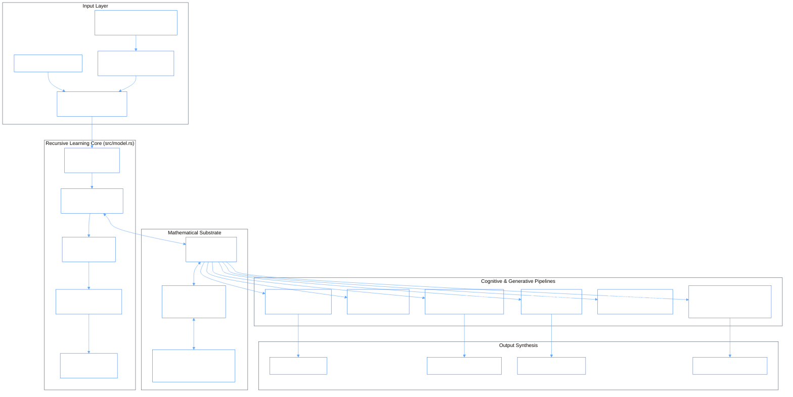
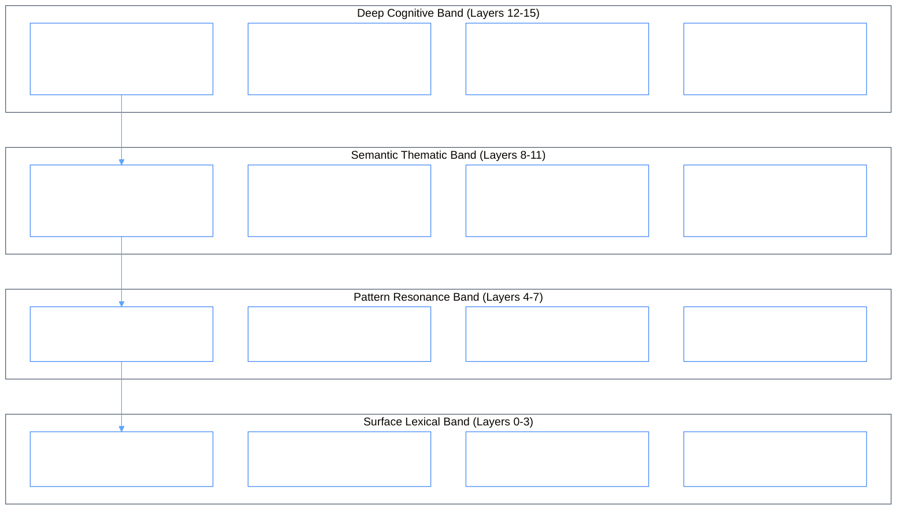

# Phiano Master Architecture & Subsystem Connections Map

> Comprehensive system topology, mathematical dataflows, module interconnections, and runtime interaction pipelines of the Phiano Continuous Phase Manifold.

---

## 1. End-to-End System Topology & Dataflow

---

## 2. Mathematical Pipeline Connections

$$\begin{CD}
\text{Raw Text Tokens} @>\text{Tokenizer}>> \text{SpectralPhasor } \mathbf{Z}_k = A_k e^{i(\phi_k + n\alpha)} \\
@VV\text{Sentence Superposition}V @VV\text{Kuramoto Attraction}V \\
\bar{\mathbf{Z}} = \frac{1}{N}\sum e^{i\phi_j} @>\text{Phase Update}>> \phi_k \leftarrow \phi_k + K \sin(\psi - \phi_k) \\
@VV\text{Destructive Metric}V @VV\text{16-Layer Octave}V \\
\Delta = \alpha \|\mathbf{Z}_1 - \mathbf{Z}_2\|^2 @>\text{Attractor Pathfinding}>> \text{Converged Semantic Reasoning } (\Delta\phi < 0.01)
\end{CD}$$

---

## 3. Subsystem Interconnection Matrix

| From Module | To Module | Data Transferred / Operation | Connection Interface |
|:---|:---|:---|:---|
| [`src/tokenizer.rs`](file:///c:/Users/phiac/Workspace/gemphi/phiano/src/tokenizer.rs) | [`src/facet.rs`](file:///c:/Users/phiac/Workspace/gemphi/phiano/src/facet.rs) | Normalized word tokens & FNV-1a hash indices | `Tokenizer::tokenize(text)` |
| [`src/facet.rs`](file:///c:/Users/phiac/Workspace/gemphi/phiano/src/facet.rs) | [`src/phasor.rs`](file:///c:/Users/phiac/Workspace/gemphi/phiano/src/phasor.rs) | Phase angle $\phi \in [0, 2\pi)$, amplitude $A$, energy band $n$ | `SpectralPhasor::new(...)` |
| [`src/phasor.rs`](file:///c:/Users/phiac/Workspace/gemphi/phiano/src/phasor.rs) | [`src/wave.rs`](file:///c:/Users/phiac/Workspace/gemphi/phiano/src/wave.rs) | Complex numbers (`c64`), ray-casting angular bounds | `Wave::ray_cast(facet, wave, k)` |
| [`src/trainer/mod.rs`](file:///c:/Users/phiac/Workspace/gemphi/phiano/src/trainer/mod.rs) | [`src/facet.rs`](file:///c:/Users/phiac/Workspace/gemphi/phiano/src/facet.rs) | Kuramoto coupling delta updates, bigram/trigram transition graphs | `facet.lexicon.get_mut(w)` |
| [`src/eval.rs`](file:///c:/Users/phiac/Workspace/gemphi/phiano/src/eval.rs) | [`src/memory/mod.rs`](file:///c:/Users/phiac/Workspace/gemphi/phiano/src/memory/mod.rs) | Coherence score $r \in [0, 1]$, novelty delta $\Delta$, verdict | `Memo::new(layer, text, eval)` |
| [`src/generate.rs`](file:///c:/Users/phiac/Workspace/gemphi/phiano/src/generate.rs) | [`src/attention.rs`](file:///c:/Users/phiac/Workspace/gemphi/phiano/src/attention.rs) | Context wave buffer superposition $\mathbf{Z}_{\text{ctx}}$ and candidates | `attention_next_words(...)` |
| [`src/compose/`](file:///c:/Users/phiac/Workspace/gemphi/phiano/src/compose/) | [`src/oscillator/`](file:///c:/Users/phiac/Workspace/gemphi/phiano/src/oscillator/) | Chromatic sector banks, river flow trajectory, harmony score | `RiverFlow::compose(...)` |
| [`src/reasoning.rs`](file:///c:/Users/phiac/Workspace/gemphi/phiano/src/reasoning.rs) | [`src/wave.rs`](file:///c:/Users/phiac/Workspace/gemphi/phiano/src/wave.rs) | Phase-space step vectors, energy minimization gradient | `ReasoningEngine::solve(...)` |
| [`src/persona/`](file:///c:/Users/phiac/Workspace/gemphi/phiano/src/persona/) | [`src/facet.rs`](file:///c:/Users/phiac/Workspace/gemphi/phiano/src/facet.rs) | 16-sector voice fingerprint, characteristic frequency distribution | `Persona::from_text(...)` |
| [`src/server/`](file:///c:/Users/phiac/Workspace/gemphi/phiano/src/server/) | [`web/`](file:///c:/Users/phiac/Workspace/gemphi/phiano/web/) | JSON HTTP responses, server-sent phasor telemetry | REST API (`/v1/eval`, `/v1/stats`) |

---

## 4. 16-Layer Cognitive Hierarchy & Octave Scale

Interactions and conceptual representations are structured into 4 octave bands comprising 16 discrete layers:

---

## 5. Connections to the GemPhi Ecosystem (PhiADK / Phient)

Phiano serves as the fundamental harmonic phase substrate within the GemPhi ecosystem:
- **`phiadk.agents.phigen`**: Uses Phiano's phase-based synthesis for code generation and dataclass construction.
- **`phiadk.agents.phirag`**: Interfaces with Phiano's ray casting for zero-matrix complex vector similarity and document retrieval.
- **`phiadk.ontologies`**: Models ontology entity spaces as phase manifolds where morphisms correspond to wave interference transformations.
- **`phiadk.agents.phibus`**: Emits real-time state mutation events on the `ontology.action.*` topic when Phiano trains and scales.
