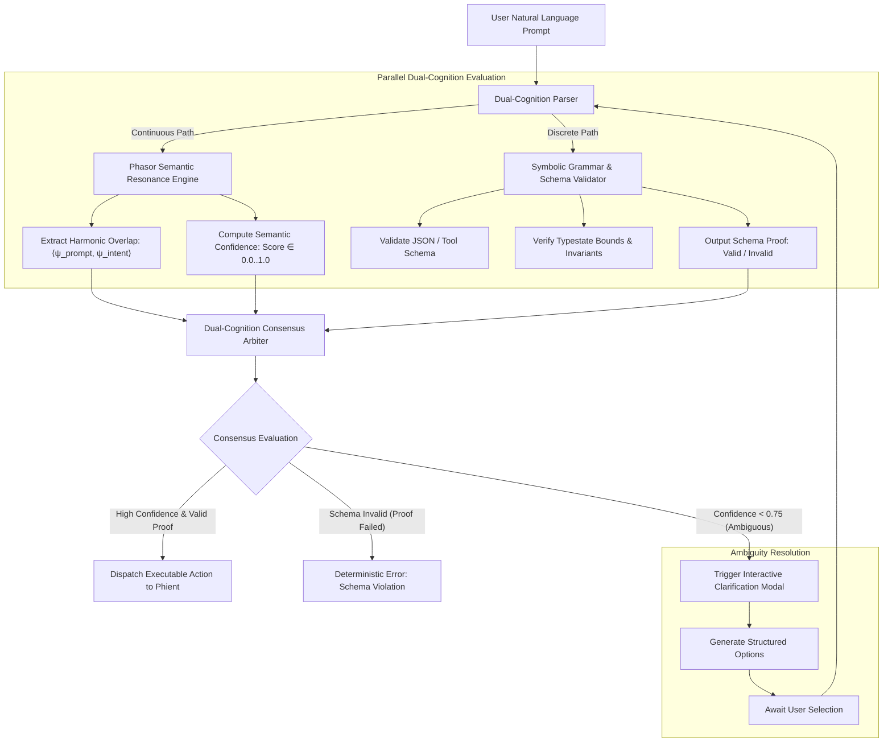

# SPEC-003: Dual-Cognition Language Engine (Continuous Resonance + Discrete Grammar)

## 1. Executive Summary & Theoretical Grounding

> **Deep Learning Concept Reference (Chollet DL Book §14.4)**:
> *"Value-centric analogy (continuous similarity, perception, intuition) must be coupled with program-centric analogy (exact discrete structure, formal reasoning, rules). In natural language processing and agent execution, semantic nuance is geometric and continuous, but correctness, tool arguments, and safety assertions are discrete and symbolic."*

Phiano couples a continuous **Phasor Semantic Field** (capturing metaphorical overlap, tone, and multi-concept harmonic resonance) with a discrete **Symbolic Grammar & Invariant Parser** (enforcing JSON schema validity, tool argument boundaries, and formal intent proofs).

---

## 2. Architectural Hierarchy Tree

```
phiano::language / phiano::intent
├── Value-Centric Semantic Intuition Subsystem
│   ├── Phasor Semantic Embeddings: Token ──► Complex Phasor State ψ_tok
│   ├── Harmonic Resonance Matcher: Computes inner-product similarity spectrum
│   ├── Tone & Context Phase Modulation: Modulates carrier wave frequencies
│   ├── Multi-Concept Superposition: Blends intent vectors via quantum-like amplitudes
│   └── Intent Candidate Generator: Ranked vector of candidate semantic intents
├── Program-Centric Symbolic Verification Subsystem
│   ├── Deterministic Grammar Lexer & Parser (Rust match-based recursive descent)
│   ├── JSON Schema & Typestate Constraint Validator
│   ├── Tool Call Boundary Verifier (Validates parameter bounds, ranges, and types)
│   ├── Formal Safety Invariant Checker
│   └── AST Syntax Tree Reconstructor (Generates deterministic command trees)
└── Dual-Cognition Intent Arbiter
    ├── Intent Consensus Engine (Neural Confidence Score × Grammar Validity Boolean)
    ├── Ambiguity Interceptor (Triggers interactive clarification on score < 0.75)
    ├── Disambiguation Question Synthesizer (Generates targeted multiple-choice prompts)
    └── Validated Command Dispatcher (Dispatches executable intent to agent runtime)
```

---

## 3. Component Interaction & Execution Flow



---

## 4. Technical Specification & Data Structures

### 4.1 Dual-Cognition Language Metrics

| Parameter | Domain | Mathematical Meaning | Minimum Threshold | Action on Breach | Recovery SLA |
| :--- | :--- | :--- | :--- | :--- | :--- |
| **Resonance Score $\mathcal{S}_{\text{res}}$** | $[0.0, 1.0]$ | Harmonic semantic alignment | $\ge 0.75$ | Prompts user for intent clarification | Interactive UI ($<100\text{ms}$) |
| **Grammar Proof $\mathcal{P}_{\text{gram}}$** | `bool` | Strict deterministic syntax validity | `true` | Rejects prompt as unparseable syntax error | Instant return ($<1\text{ms}$) |
| **Argument Bound $\mathcal{B}_{\text{args}}$** | `bool` | Parameters within authorized limits | `true` | Returns typed error with expected schema range | Instant return ($<1\text{ms}$) |
| **Ambiguity Entropy $H_{\text{intent}}$** | $\mathbb{R}^+$ | Entropy over candidate intent distribution | $\le 0.45\text{ nats}$ | Disambiguation prompt rendered in chat UI | Interactive UI ($<100\text{ms}$) |
| **Parsing Turnaround** | Milliseconds | End-to-end intent extraction duration | $<2.0\text{ms}$ | Enforces bounded recursion parsing depth | $O(N)$ text length bound |

### 4.2 Mathematical Formulations

#### 4.2.1 Semantic Intent Confidence
$$\mathcal{S}_{\text{res}}(\text{Prompt}, \text{Intent}_k) = \frac{|\langle \psi_{\text{prompt}}, \psi_{\text{intent}_k} \rangle|}{\|\psi_{\text{prompt}}\| \|\psi_{\text{intent}_k}\|}$$

#### 4.2.2 Intent Entropy & Ambiguity Threshold
$$H_{\text{intent}} = -\sum_{k=1}^K p_k \ln p_k, \quad p_k = \frac{e^{\mathcal{S}_k / \tau}}{\sum_j e^{\mathcal{S}_j / \tau}}$$
When $H_{\text{intent}} > 0.45\text{ nats}$, the intent is mathematically ambiguous, triggering clarification rather than guessing.

---

## 5. Rust Implementation Signatures

```rust
use serde::{Deserialize, Serialize};

#[derive(Debug, Clone, Serialize, Deserialize)]
pub struct SemanticIntent {
    pub intent_name: String,
    pub resonance_score: f64,
    pub extracted_parameters: serde_json::Value,
    pub schema_verified: bool,
    pub entropy: f64,
}

pub struct DualLanguageEngine {
    phasor_field: Arc<PhasorSemanticField>,
    grammar_validator: Arc<GrammarSchemaValidator>,
    ambiguity_threshold: f64,
}

impl DualLanguageEngine {
    pub fn new(
        phasor_field: Arc<PhasorSemanticField>,
        grammar_validator: Arc<GrammarSchemaValidator>,
        ambiguity_threshold: f64,
    ) -> Self;

    pub fn parse_intent(&self, text: &str) -> Result<SemanticIntent, LanguageParseError>;

    pub fn verify_tool_call(
        &self,
        intent: &SemanticIntent,
        expected_schema: &serde_json::Value,
    ) -> Result<ValidatedToolCall, ToolValidationError>;

    pub fn synthesize_disambiguation_options(&self, text: &str) -> Vec<String>;
}
```

---

## 6. Verification & Test Criteria

1. **Zero False-Positive Tool Execution**: An ambiguous prompt (e.g. "cancel everything") must trigger clarification if $H_{\text{intent}} > 0.45$, avoiding catastrophic unintended execution.
2. **Schema Invariant Proof**: Even if semantic resonance is $0.999$, an input with a type-mismatched argument (e.g. string for integer price) must be rejected deterministically by the grammar validator.
3. **Sub-Millisecond Turnaround**: Complete dual-cognition intent extraction and schema proof must execute in $<1.5\text{ms}$ on a single CPU core.
4. **Deterministic Reproducibility**: Given identical input strings, intent categorization and confidence scores must produce bit-for-bit identical results across runs.
