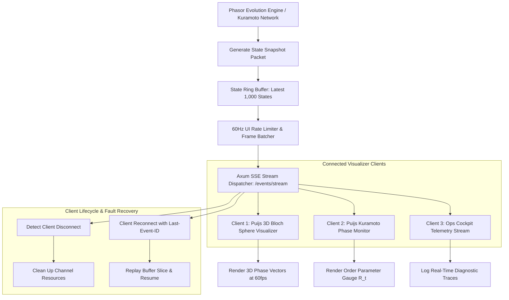

# SPEC-004: Continuous Real-Time SSE Telemetry & Cognitive Spaces Bridge

## 1. Executive Summary & Theoretical Grounding

> **Deep Learning Concept Reference (Chollet DL Book §14.6)**:
> *"Models in production require continuous real-time empirical observability. A continuous event streaming architecture bridges internal high-dimensional neural states and human-facing diagnostics without polling overhead, stale caches, or artificial request-response lag."*

Phiano implements a high-throughput **Server-Sent Events (SSE)** telemetry bridge that streams phasor coordinates, Kuramoto order parameters $R(t)$, and semantic resonance matrices to `puijs` 3D visualizers in real-time.

---

## 2. Architectural Hierarchy Tree

```
phiano::server / phiano::telemetry
├── High-Throughput Axum SSE Dispatcher
│   ├── Broadcast Channel: tokio::sync::broadcast::Sender<SsePayload>
│   ├── Event Multiplexer: EventRouter (Phasor, Kuramoto, Semantic, Heartbeat)
│   ├── Client Connection Manager (Tracks active browser visualizer subscribers)
│   ├── Backpressure Guard (Drops stale frames if subscriber socket buffer fills)
│   └── Graceful Channel Teardown (Recovers socket descriptors on tab close)
├── Ring-Buffer State Slicer
│   ├── Lock-Free Snapshot Extractor (ArcSwap / RwLock)
│   ├── 60Hz Target Rate Limiter (Batches sub-millisecond updates for 60fps UI)
│   ├── Circular Frame Buffer (Pre-allocated fixed-size ring buffer)
│   └── Zero-Copy JSON Serializer (Direct write to stream output buffers)
└── Cognitive Spaces Web Bridge
    ├── HTTP Endpoint: GET /events/stream (Content-Type: text/event-stream)
    ├── CORS & Compression Middleware (Tower-HTTP)
    ├── Heartbeat Keep-Alive Worker (Emits ping every 15 seconds)
    ├── Reconnection Offset Synchronizer (Replays missed events on reconnect)
    └── Sub-10ms End-to-End Latency Guarantee
```

---

## 3. Component Interaction & Execution Flow



---

## 4. Technical Specification & Data Structures

### 4.1 SSE Event Stream Schema Specification

| Event Name | JSON Payload Fields | Broadcast Rate | Target UI Consumer | Purpose | Downstream Impact |
| :--- | :--- | :--- | :--- | :--- | :--- |
| `phasor_state` | `{ frequencies: f64[], amplitudes: f64[], phases: f64[], energy: f64 }` | $60\text{ Hz}$ | `VolSurfaceManifold3D` | Continuous state visualization | 3D mesh curvature updates |
| `kuramoto_sync` | `{ order_parameter: f64, mean_phase: f64, cascade_alert: bool }` | $60\text{ Hz}$ | `KuramotoPhaseSphere` | Real-time synchrony tracking | Order arrow & pulse alert |
| `semantic_matrix`| `{ token_labels: string[], resonance_matrix: f64[][] }` | $10\text{ Hz}$ | `DocsPortal` / Diagnostics | Concept proximity grid | Heatmap matrix coloring |
| `heartbeat` | `{ server_time_ns: u64, active_subscribers: usize }` | $0.1\text{ Hz}$ | Connection Keep-Alive | Prevents browser timeout | Socket health check |

---

## 5. Rust Implementation Signatures

```rust
use axum::response::sse::{Event, KeepAlive, Sse};
use serde::{Deserialize, Serialize};
use std::sync::Arc;
use tokio_stream::Stream;

#[derive(Debug, Clone, Serialize, Deserialize)]
pub struct SseTelemetryMessage {
    pub event_type: String,
    pub payload: serde_json::Value,
    pub timestamp_ns: u64,
}

pub struct TelemetryStreamServer {
    broadcast_sender: tokio::sync::broadcast::Sender<SseTelemetryMessage>,
    active_client_count: std::sync::atomic::AtomicUsize,
    history_buffer: std::sync::RwLock<VecDeque<SseTelemetryMessage>>,
}

impl TelemetryStreamServer {
    pub fn new(channel_capacity: usize) -> Self;
    pub fn broadcast(&self, msg: SseTelemetryMessage);
    pub fn create_sse_stream(&self) -> Sse<impl Stream<Item = Result<Event, std::convert::Infallible>>>;
    pub fn client_count(&self) -> usize;
    pub fn replay_since(&self, timestamp_ns: u64) -> Vec<SseTelemetryMessage>;
}

pub struct SseFrameRateLimiter {
    target_fps: u32,
    last_emit_time: std::time::Instant,
}

impl SseFrameRateLimiter {
    pub fn new(target_fps: u32) -> Self;
    pub fn should_emit(&mut self) -> bool;
}
```

---

## 6. Verification & Test Criteria

1. **Client Disconnection Fault Tolerance**: When a visualizer tab is closed, the server must automatically drop the subscriber channel without panicking or memory leaking.
2. **UI Frame Synchronization SLA**: End-to-end event generation to browser DOM update latency must measure $<10\text{ms}$ over localhost connections.
3. **High-Load Broadcast Stability**: Broadcasting to 100 concurrent SSE subscribers at $60\text{ Hz}$ must consume $<5\%$ CPU and $<30\text{MB}$ RAM.
4. **Zero Buffer Overflow Crash**: If a slow client fails to consume events, the broadcast channel must discard lagging frames rather than unbounded heap growth.
5. **Reconnection Recovery**: Disconnecting and reconnecting within 5 seconds must seamlessly resume telemetry stream without missing the critical state transition.
