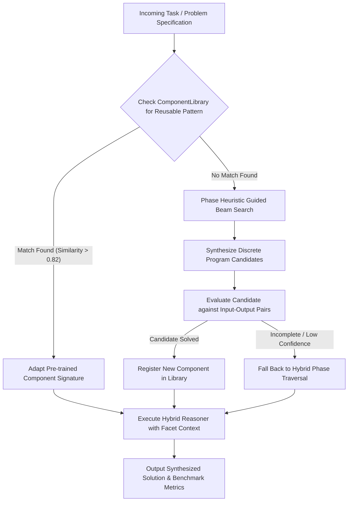

# SPEC-005: Program Synthesis, Hybrid Reasoning & Lifelong Learning

## 1. Executive Summary & Theoretical Grounding

> **Deep Learning Concept Reference (Chollet DL Book §14.4 & §14.5)**:
> *"Deep learning excels at perception and continuous geometric interpolation (value-centric analogy), but fails at discrete symbolic manipulation and compositional generalization. The future of artificial intelligence lies in the unification of continuous geometric representations with discrete program synthesis, guided by learned heuristics and lifelong component reuse."*

Phiano implements a dual-system cognitive architecture:
1. **System 1 (Geometric Phase Manifold)**: High-dimensional continuous phase interpolation $\mathbb{C}^N$ across chromatic harmonic sectors for instant semantic perception and fluid linguistic intuition.
2. **System 2 (Program Synthesis & Component Library)**: Discrete symbolic search over functional primitives (`Map`, `Filter`, `Reduce`, `Compose`, `Sort`, `Reverse`) guided by phase-energy heuristics and accumulated into a persistent, reusable `ComponentLibrary`.

This specification formalizes the hybrid reasoning pipeline, program synthesis grammar, lifelong learning transfer mechanisms, and ARC (Abstraction and Reasoning Corpus) evaluation protocols.

---

## 2. Architectural Hierarchy Tree

```
phiano::synthesis & phiano::lifelong
├── Discrete Program Synthesis Engine (phiano::synthesis)
│   ├── Program AST Structure
│   │   ├── Program: { operations: Vec<ProgramOp>, phase_template: Vec<f64> }
│   │   └── ProgramOp: Map | Filter | Reduce | Compose | Sort | Reverse
│   ├── Beam Search Combinatorial Engine (phiano::synthesis::search)
│   │   ├── Candidate Enumerator (bounded search depth d ≤ 8)
│   │   └── Program Evaluator: score(P, examples) ∈ [0.0, 1.0]
│   ├── Phase-Guided Search Heuristics (phiano::synthesis::heuristic)
│   │   └── Phase Heuristic: Pr(Op | Δθ, A) prioritizing search branches
│   └── Reusable Component Library (phiano::synthesis::library)
│       └── ComponentRegistry: Vec<{ name, program, phase_signature, reuse_count }>
├── Hybrid Multimodal Reasoning (phiano::reasoning)
│   ├── Value-Centric Geometric Analogy (phiano::reasoning::analogy)
│   ├── Program-Centric Structural Analogy (phiano::reasoning::program_analogy)
│   ├── Multi-Path Phase Traversal (phiano::reasoning::multi_path)
│   └── Hybrid Resolver: score = α · score_geom + (1 - α) · score_prog
└── Lifelong Learning & Meta-Adaptation (phiano::lifelong)
    ├── LifelongLearner: Library search → Adaptation → Scratch fallback
    ├── MetaModel: Few-shot adaptation rates across task distributions
    └── ModelMonitor: Real-time distribution shift & performance regression alerts
```

---

## 3. Operational Flow Diagram



---

## 4. Discrete Program Grammar & Mathematical Formulations

### 4.1 Program Primitives Grammar

$$\mathcal{P} ::= \text{Op}_1 \circ \text{Op}_2 \circ \dots \circ \text{Op}_k$$

$$\text{Op} \in \{ \text{Map}(f), \text{Filter}(p), \text{Reduce}(\oplus, z), \text{Compose}, \text{Sort}(\theta), \text{Reverse} \}$$

| Primitive Operation | Type Signature | Phase Transformation Mapping | Complexity |
| :--- | :--- | :--- | :--- |
| `Map(f)` | `Vec<T> -> Vec<U>` | $\theta'_i = (\theta_i + \Delta\theta_f) \pmod{2\pi}$ | $\mathcal{O}(N)$ |
| `Filter(p)` | `Vec<T> -> Vec<T>` | Retain $t_i \iff \cos(\theta_i - \theta_p) \ge \tau$ | $\mathcal{O}(N)$ |
| `Reduce(\oplus, z)` | `Vec<T> -> T` | $\Psi = \sum_{i=1}^N A_i e^{i\theta_i}$ | $\mathcal{O}(N)$ |
| `Sort(\theta)` | `Vec<T> -> Vec<T>` | Sort by angular distance $\text{dist}(\theta_i, \theta_{\text{ref}})$ | $\mathcal{O}(N \log N)$ |
| `Reverse` | `Vec<T> -> Vec<T>` | Invert index order & conjugate phase: $\theta'_i = -\theta_{N-i}$ | $\mathcal{O}(N)$ |
| `Compose` | `Vec<Vec<T>> -> String` | Harmonic sector stitching across flow paths | $\mathcal{O}(K \cdot N)$ |

---

### 4.2 Hybrid Analogy Formulation

Given source pair $(A, B)$ and target query $C$, the analogy target $D$ satisfies:

$$\text{Score}(D) = \alpha \cdot \cos\Big( (\theta_B - \theta_A) - (\theta_D - \theta_C) \Big) + (1 - \alpha) \cdot \text{StructuralOverlap}\Big( \mathcal{P}(A \to B), \mathcal{P}(C \to D) \Big)$$

where $\alpha \in [0, 1]$ balances continuous metric distance with discrete program isomorphism.

---

## 5. Lifelong Learning & Benchmark Telemetry

| Benchmark Metric | Module Path | Evaluation Target | Target Threshold |
| :--- | :--- | :--- | :--- |
| **Local Generalization** | `phiano::metrics::generalization` | Intra-distribution interpolation | $\ge 0.88$ Coherence |
| **Extreme Generalization** | `phiano::metrics::generalization` | Out-of-distribution extrapolation | $\ge 0.65$ Coherence |
| **Adversarial Robustness** | `phiano::metrics::adversarial` | Sensitivity to $\epsilon$-phase jitter | $\le 0.15$ Delta |
| **ARC Rule Induction** | `phiano::metrics::arc` | Few-shot rule induction from $\le 3$ pairs | $\ge 0.80$ Accuracy |
| **Adaptation Efficiency** | `phiano::metrics::adaptation` | Gradient steps to $80\%$ task coherence | $\le 4$ Iterations |
| **Component Reuse Rate** | `phiano::lifelong::history` | Percentage of tasks solved via library | $\ge 40\%$ Over Lifetime |

---

## 6. Verification and Test Invariants

1. **Deterministic Execution**: Program synthesis with seed state must produce identical candidate rank orders.
2. **Phase Boundary Safety**: All synthesized operations guarantee phase outputs wrap strictly to $[0, 2\pi)$.
3. **Memory Bounding**: `ComponentLibrary` enforces LRU eviction when capacity exceeds $K_{\text{max}} = 1024$ entries.
4. **Thread Safety**: All synthesis evaluation methods are stateless and callable concurrently via Rayon thread pools.
