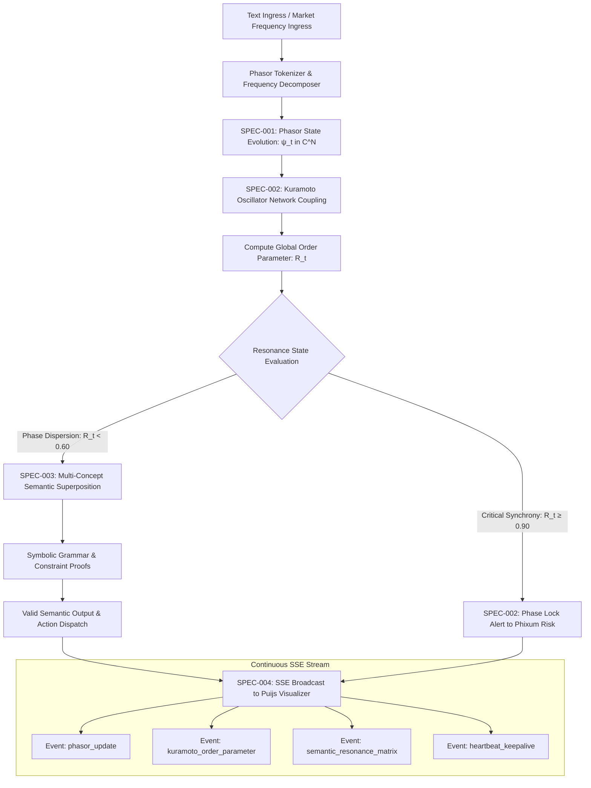

# Phiano Cognitive Specifications: Chapter 14 Phase Resonance & Dual Cognition

## 1. Executive Overview

This directory contains the formal architectural specifications applying the principles from **Chapter 14 ("Conclusions") of François Chollet's *Deep Learning with Python* (2nd Edition)** to Phiano, the phase-instrument for language and cognitive oscillatory dynamics:

| Spec ID | Specification Document | Core Chapter 14 Mechanism | Target Modules | Primary Architectural Invariant |
| :--- | :--- | :--- | :--- | :--- |
| **SPEC-001** | [`001_phase_resonance_geometry.md`](./001_phase_resonance_geometry.md) | **14.1 Geometric Transformations in Complex Space** | `src/phasor.rs`, `src/geometry.rs` | Continuous phasor manifold $\mathbb{C}^N$, unitary energy conservation |
| **SPEC-002** | [`002_kuramoto_order_parameter.md`](./002_kuramoto_order_parameter.md) | **14.2 Extreme Generalization & Collective Phase Lock** | `src/kuramoto.rs`, `src/coherence.rs` | Order parameter $R(t) \in [0, 1]$, non-linear phase transition detection |
| **SPEC-003** | [`003_dual_cognition_language.md`](./003_dual_cognition_language.md) | **14.4 Dual-Cognition (Resonance Intuition + Grammar Verification)** | `src/language.rs`, `src/parser.rs` | Harmonic semantic overlap coupled with discrete Rust AST validation |
| **SPEC-004** | [`004_streaming_sse_telemetry.md`](./004_streaming_sse_telemetry.md) | **14.6 Continuous Telemetry & Cognitive Spaces Bridge** | `src/server/routes_core.rs` | Real-time SSE event bus streaming with sub-10ms UI update latency |
| **SPEC-005** | [`005_program_synthesis_lifelong_learning.md`](./005_program_synthesis_lifelong_learning.md) | **14.4 & 14.5 Program Synthesis, Hybrid Reasoning & Lifelong Learning** | `src/synthesis/`, `src/lifelong/`, `src/reasoning/` | Dual System 1 (continuous manifold) + System 2 (discrete program search & component library) |

---

## 2. Global Cognitive Architecture Hierarchy

```
Phiano Cognitive Oscillatory Ecosystem
├── Layer 1: Continuous Phasor Manifold (SPEC-001)
│   ├── Complex State Representation: ψ(t) = sum_k A_k * exp(i * (ω_k * t + φ_k))
│   ├── Unitary Operator Transformations: U(t) ψ(0) = ψ(t) (Energy Invariant)
│   ├── Hamiltonian Time-Evolution Generator: H = diag(ℏ * ω_k)
│   ├── Phase Gradient Flow Optimizer: dψ/dt = -i * H * ψ
│   └── Harmonic Semantic Inner Products: ⟨ψ_A, ψ_B⟩ ──► Resonance Spectrum
├── Layer 2: Kuramoto Phase Synchrony Engine (SPEC-002)
│   ├── Coupled Non-Linear Oscillators: dθ_i/dt = ω_i + (K/N) * sum_j sin(θ_j - θ_i)
│   ├── Global Order Parameter Vector: R(t) * exp(i * Ψ(t)) = (1/N) * sum_j exp(i * θ_j)
│   ├── Mean-Field Fast Evaluator: O(N) evaluation replacing O(N^2) pairwise loops
│   ├── Runge-Kutta 4th Order Integrator (RK4) with bounded phase wrapping
│   └── Critical Cascade Detector: Emits risk alerts on R(t) > 0.90
├── Layer 3: Dual-Cognition Language & Semantic Core (SPEC-003)
│   ├── Value-Centric Phase Field: Continuous associative concept overlap
│   ├── Program-Centric Symbolic Validator: Grammar constraints & JSON schema proofs
│   ├── Ambiguity Entropy Calculator: H_intent = -sum(p_k * ln(p_k))
│   ├── Intent Resonance Synthesizer: Maps language queries to actionable tools
│   └── Typestate Verification Gateway: Blocks invalid parameter type coercion
└── Layer 4: Real-Time SSE Telemetry & Cognitive Streamer (SPEC-004)
    ├── High-Throughput Axum SSE Broadcast: GET /events/stream
    ├── Tokio Stream Ring Buffer Dispatcher with 60Hz Rate Limiting
    ├── Cognitive Spaces Bridge: Synchronizes 3D UI spheres with oscillator states
    ├── Client Lifecycle Manager: Automatic reconnection & graceful cleanup
    └── Zero-Allocation JSON Streaming Serializer: Direct write to response buffers
```

---

## 3. Global Data Flow & Processing Pipeline



---

## 4. Technical Specification Matrix

| Metric / Parameter | Mathematical Formula | Target Operating Range | Critical Threshold | Purpose | Downstream Impact |
| :--- | :--- | :--- | :--- | :--- | :--- |
| **Phasor Amplitude $\|\psi\|$** | $\sqrt{\sum_{k=1}^N (a_k^2 + b_k^2)}$ | $1.000 \pm 10^{-6}$ | $>1.0001$ | Unitary conservation | Guarantees numerical stability |
| **Kuramoto Order $R(t)$** | $\left\|\frac{1}{N}\sum_{j=1}^N e^{i\theta_j}\right\|$ | $[0.25, 0.65]$ | $\ge 0.90$ | Phase synchronization | Triggers Phixum risk widening |
| **Resonance Overlap** | $\frac{|\langle \psi_A, \psi_B \rangle|}{\|\psi_A\| \|\psi_B\|}$ | $[0.0, 1.0]$ | $\ge 0.85$ | Semantic similarity | Selects intent matching candidate |
| **Intent Entropy $H$** | $-\sum p_k \ln p_k$ | $[0.0, 0.35]$ | $\ge 0.45\text{ nats}$ | Ambiguity quantification | Intercepts ambiguous commands |
| **SSE UI Latency** | $t_{\text{render}} - t_{\text{event}}$ | $<10\text{ms}$ | $>50\text{ms}$ | 60fps real-time UI | Prevents visual frame stuttering |

---

## 5. Architectural Quality Attributes & Operational Constraints

1. **Unitary Energy Conservation**: All continuous phase transformations preserve total energy $\sum |A_k|^2 \equiv 1.0$ within machine precision across long horizons.
2. **Lock-Free Concurrency**: Oscillator phase arrays are updated via atomic floating-point bitwise operations or `ArcSwap` buffers.
3. **Cross-Repository Coherence**: Phase order parameter $R(t)$ connects directly to `phixum` risk circuit breakers and `puijs` 3D phase spheres.
4. **Graceful Degradation**: If client network bandwidth drops, the SSE broadcaster drops intermediate animation frames to prioritize latency over buffer queueing.
5. **Deterministic Replay**: Given an initial seed vector $\psi(0)$ and frequency vector $\mathbf{\Omega}$, phase evolution trajectories are bit-for-bit identical across runs.
6. **Zero Allocation Hot Path**: High-frequency phase rotations execute in-place on stack or pre-allocated buffers without triggering heap allocations.

---

## 6. Glossary of Phasor Dynamics Terms

| Term | Formal Definition | Role in System Architecture |
| :--- | :--- | :--- |
| **Phasor** | Rotating vector in complex plane $\psi = A e^{i\theta}$ | Base representation of semantic tokens & cyclical states |
| **Phase Coherence** | Degree of phase alignment across multiple oscillators | Indicator of concept synergy or collective market herd behavior |
| **Order Parameter $R$** | Magnitude of normalized sum of phase unit vectors | Macro-level metric detecting order-to-chaos phase transitions |
| **Dual Cognition** | Coupling of continuous wave intuition + discrete grammar | Ensures generative responses are both nuanced and formally safe |
| **Bloch Sphere** | 2D Riemannian surface embedding 2-level state superpositions | Visual canvas for quantum-like semantic state inspection |
| **Harmonic Resonance** | Constructive interference of overlapping phase frequencies | Measures associative similarity between prompts and knowledge |
